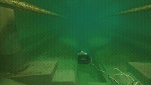
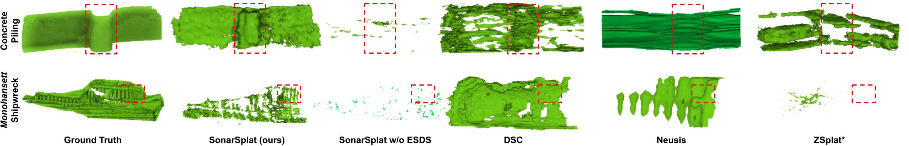

# SonarSplat: Novel View Synthesis of Imaging Sonar via Gaussian Splatting.  

IEEE Robotics and Automation Letters 2025

Advaith V. Sethuraman<sup>1</sup>, Max Rucker<sup>1</sup>, Onur Bagoren<sup>1</sup>, Pou-Chun Kung<sup>1</sup>, Nibarkavi N.B. Amutha<sup>1</sup>, and Katherine A. Skinner<sup>1</sup>

<sup>1</sup>Department of Robotics, University of Michigan, Ann Arbor, MI, USA.

**Abstract:** In this paper, we present SonarSplat, a novel Gaussian splatting framework for imaging sonar that demonstrates
realistic novel view synthesis and models acoustic streaking
phenomena. Our method represents the scene as a set of 3D
Gaussians with acoustic reflectance and saturation properties.
We develop a novel method to efficiently rasterize Gaussians to
produce a range/azimuth image that is faithful to the acoustic
image formation model of imaging sonar. In particular, we
develop a novel approach to model azimuth streaking in a
Gaussian splatting framework. We evaluate SonarSplat using
real-world datasets of sonar images collected from an underwater
robotic platform in a controlled test tank and in a real-world lake
environment. Compared to the state-of-the-art, SonarSplat offers
improved image synthesis capabilities (+3.2 dB PSNR) and more
accurate 3D reconstruction (77% lower Chamfer Distance). We
also demonstrate that SonarSplat can be leveraged for azimuth
streak removal.

<div align="center">

<a href="https://arxiv.org/abs/2504.00159"></a>
<a href="https://umfieldrobotics.github.io/sonarsplat3D/"></a>
<a href="https://ieeexplore.ieee.org/document/11223217"></a>
<a href="https://drive.google.com/file/d/1sDGprDT-kS-Eunt5XjXAFMkMe1t3GIbd/view?usp=drive_link"></a>


</div>

<div align="center">

</div>
<div align="center">

</div>


## Installation

Create a conda environment with Python 3.10:

```bash
conda create -n sonarsplat python=3.10 -y
conda activate sonarsplat
```

**Dependency**: Please install [Pytorch](https://pytorch.org/get-started/locally/) first.

Install the required dependencies:

```bash
git submodule update --init --recursive
pip install -e . 
```

```bash
pip install -r requirements.txt
```

## Data

Download the released dataset from: 

```
dataset/
├── basin_horizontal_empty1/
├── basin_horizontal_infra_1/
└── monohansett_3D/
    ├── Data/
    ├── sonar_images/
    ├── bounds.txt
    ├── Config.json
    └── gt.ply (only in 3D datasets)
```

Data contains `.pkl` files with sensor pose (`data['PoseSensor']`) and sonar images (`data['ImagingSonar']`). `sonar_images/` is used primarily for debugging/choosing subsequences. `bounds.txt` has the 3D bounds of the scene. 

## Experiments

SonarSplat allows for novel view synthesis and 3D reconstruction. We have provided some training commands with parameters to reproduce some of our experiments from the paper.  

### Novel View Synthesis

#### Training

Train the model for novel view synthesis on the `infra_360_1` dataset:

```
bash scripts/run_nvs_infra_360_1.sh --data_dir <data_dir> --results_dir <results_dir>
```
#### Evaluation

We evaluate SonarSplat and baselines using PSNR, SSIM, LPIPS. 
Please organize your rendered images like so: 

```
root_dir/
├── baseline1/
├── baseline2/
└── sonarsplat/
    ├── scene1/
    └── scene2/
        └── sonar_renders/
            ├── gt_sonar_images/
            │   ├── 0000.png
            │   ├── 0001.png
            │   └── ...
            └── sonar_images/
                ├── 0000.png
                ├── 0001.png
                └── ...
```

Run: 

```bash
python examples/evaluate_imgs.py --root_folder <root_folder>
```
The script will save a `.csv` file conveniently listing all metrics compared to baselines. 

In the event that you want to validate all methods use the same GT images, run: 

```bash
python examples/evaluate_imgs.py --validate_only
```

### 3D Reconstruction

#### Training

Train the model for 3D reconstruction on the `Monohansett Shipwreck` dataset:

```
bash scripts/run_3D_monohansett.sh --data_dir <data_dir> --results_dir <results_dir>
```

#### Evaluation

First, we will need to convert the splat into a mesh: 

```bash 
python mesh_gaussian.py --ply_path <results_dir>/renders/output_step<iter>.ply 
```
Note: you must perform ICP/manual alignment to get the GT and predicted mesh in the same frame first. Then, organize your meshes in this structure. Please copy over the GT meshes from `concrete_piling_3D` and `monohansett_3D`: 

```
root_dir/
├── gt/
│   ├── <scene1>/
│   │   └── gt.ply
│   ├── <scene2>/
│   │   └── gt.ply
│   └── ...
├── preds/
│   ├── baseline1/
│   │   ├── <scene1>/
│   │   │   └── pred.ply
│   │   ├── <scene2>/
│   │   │   └── pred.ply
│   │   └── ...
│   ├── baseline2/
│   │   ├── <scene1>/
│   │   │   └── pred.ply
│   │   ├── <scene2>/
│   │   │   └── pred.ply
│   │   └── ...
│   └── sonarsplat/
│       ├── <scene1>/
│       │   └── pred.ply
│       ├── <scene2>/
│       │   └── pred.ply
│       └── ...
```
You can compute metrics with the following command: 

```bash 
python scripts/compute_pcd_metrics_ply.py --gt_root <root_dir>/gt --pred_root <root_dir>/preds
```

## Citation
```
@ARTICLE{11223217,
  author={Sethuraman, Advaith V. and Rucker, Max and Bagoren, Onur and Kung, Pou-Chun and Amutha, Nibarkavi N.B. and Skinner, Katherine A.},
  journal={IEEE Robotics and Automation Letters}, 
  title={SonarSplat: Novel View Synthesis of Imaging Sonar via Gaussian Splatting}, 
  year={2025},
  volume={10},
  number={12},
  pages={13312-13319},
  keywords={Sonar;Three-dimensional displays;Azimuth;Imaging;Acoustics;Rendering (computer graphics);Reflectivity;Neural radiance field;Robots;Covariance matrices;Mapping;deep learning for visual perception;marine robotics},
  doi={10.1109/LRA.2025.3627089}}
```

## License

SonarSplat is licensed under <a href="http://creativecommons.org/licenses/by-nc-sa/4.0/?ref=chooser-v1" target="_blank" rel="license noopener noreferrer" style="display:inline-block;">CC BY-NC-SA 4.0</a></p>